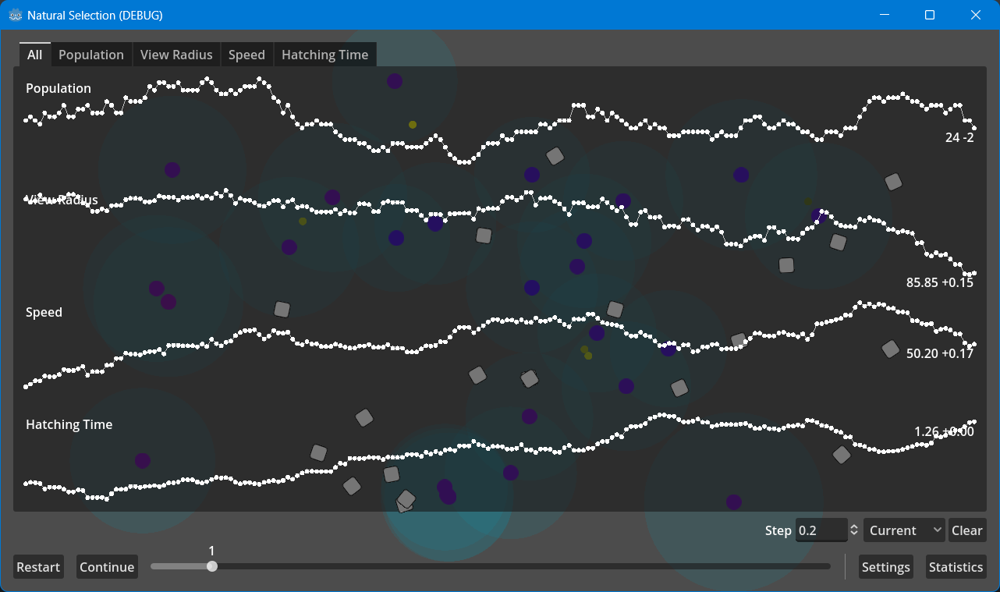

# Natural Selection

Sumilation of natural selection, built inside [**Godot Engine 4**](https://godotengine.org).



## Features

-   Simulating creatures adapting to environment over time
-   Fully customizable simulation parameters
-   Live chart tracking
-   Chart settings including simulation speed

## Getting started

### Prerequisites

To run the project you need to install **Godot Engine**. Minimal required version is **4.x**. The engine can be downloaded from various resources, including [official website](https://godotengine.org/download). C# support is not required.

> [!TIP]
> Specific version **4.2.1** was used in this project. Downloading it can help avoiding further issues.

### Repository

To get a local copy of repository open terminal and execute `git clone` command:

```
git clone https://github.com/wivest/Natural-Selection.git
```

Or download `.zip` [archive](https://github.com/wivest/Natural-Selection/archive/refs/heads/main.zip) and extract files.

### Run the project

[Import](https://docs.godotengine.org/en/stable/tutorials/editor/project_manager.html#opening-and-importing-projects) project in Godot _Project Manger_.

> [!NOTE]
> Project folder is most likely named either `Natural-Selection` or `Natural-Selection-main`

To launch project you need to select project and click `Run` button.
